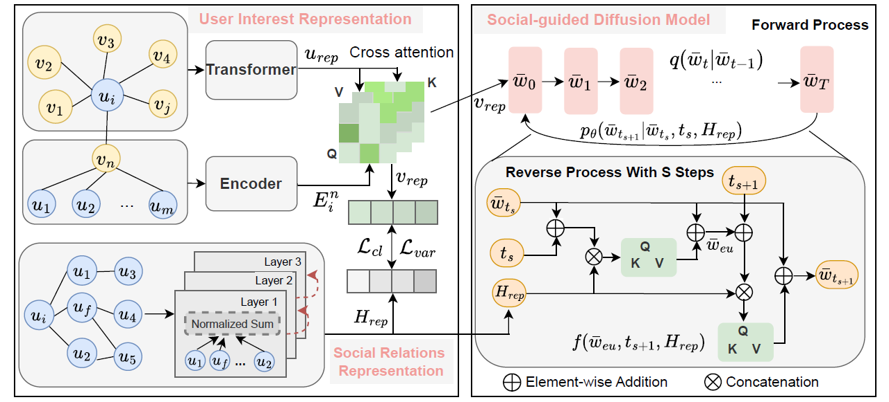

# Social-guided Conditional Diffusion Modeling for Robust Social Recommendation

This repository provides the official implementation of **SDiff**, a social recommendation model based on social-guided conditional diffusion modeling. SDiff leverages GCN-enhanced social condition modeling and diffusion-based representation generation to improve the robustness of social recommendation.

## Framework

